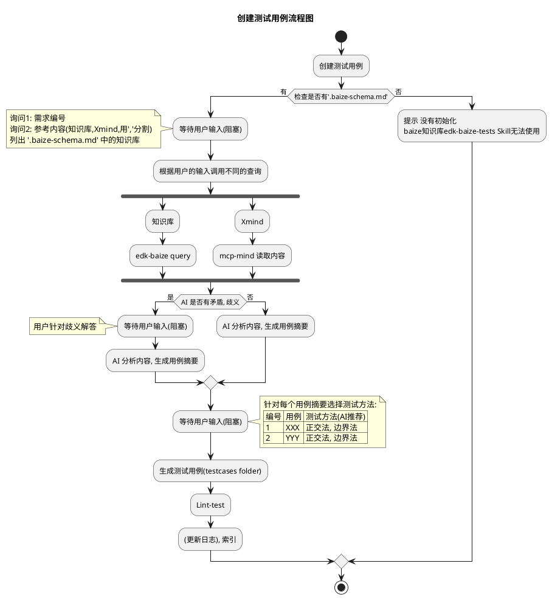

## SKILL 定义

### 目标

edk-baize-tests 是 edk-baize 的配套SKill,主要目标是通过知识库创建测试用例

### SKILL 名： edk-baize-tests

### 快速开始
触发语义："白泽，请帮我创建测试用例"


## 工作流

### create-tests
工作流程如下：


### query-tests

### lint-tests

#### 自检覆盖率流程

##### 自检步骤

1. **读取生成的测试用例文件**
   - 使用 readFile 工具读取已生成的测试用例文件
   - 提取所有测试用例的标题和覆盖的场景

2. **对比 XMind 内容**
   - 重新分析 XMind 的结构和内容
   - 列出所有需要测试的场景、状态组合、配置项
   - 识别 XMind 中的关键测试点

3. **识别遗漏的场景**
   - 对比已生成的测试用例和 XMind 内容
   - 找出未覆盖的场景、状态组合或配置
   - 列出所有遗漏的测试点

4. **补充缺失的测试用例**
   - 为每个遗漏的场景生成测试用例
   - 使用 fsAppend 工具追加到测试用例文件
   - 确保新增用例符合格式规范

5. **重复自检**
   - 再次读取更新后的测试用例文件
   - 验证是否还有遗漏
   - 如果仍有遗漏，继续补充
   - 直到覆盖率达到 100%


##### 自检要点

**场景覆盖检查**：
- 所有主要业务场景是否都有测试用例
- 所有异常场景是否都有测试用例
- 所有边界条件是否都有测试用例

##### 自检输出格式

在自检过程中，应该输出以下信息：

```
## 自检报告

### 已覆盖的场景（X 个）
1. [场景描述] - 测试用例 TC-XXXXX-XXX
2. [场景描述] - 测试用例 TC-XXXXX-XXX
...

### 未覆盖的场景（Y 个）
1. [场景描述] - 需要补充
2. [场景描述] - 需要补充
...

### 覆盖率：X / (X + Y) = Z%

### 下一步行动
- 补充 Y 个缺失的测试用例
- 重新进行自检验证
```

##### 自检完成标准

- 覆盖率达到 100%
- XMind 中的所有场景都有对应的测试用例
- 所有状态组合都被测试
- 所有配置项的不同取值都被测试
- 所有操作类型都被测试
- 所有表单类型都被测试

#### 格式自检流程

##### 格式检查步骤

1. **读取模板文件**
   - 使用 readFile 工具读取 `references/test_template.md`
   - 使用 readFile 工具读取 `references/test-task-template.md`
   - 理解模板的结构和必需字段

2. **检查测试用例格式**
   - 读取生成的测试用例文件
   - 对比模板检查以下内容：
     - 文件头部是否包含"测试套件信息"章节
     - 是否包含：功能模块、需求编号、测试目标
     - 每个测试用例是否包含：用例编号、Priority、Method、Precondition、Test Steps、Expected Result
     - Test Steps 是否使用编号列表格式
     - Expected Result 是否使用列表格式
     - 用例之间是否使用 `---` 分隔符

3. **检查任务文档格式**
   - 读取生成的任务文档文件
   - 对比模板检查以下内容：
     - 是否包含"概述"章节（XMind 文件名、生成时间）
     - 是否包含"测试用例集清单"章节
     - 清单中的 checkbox 格式是否正确（`- [ ]` 或 `- [x]`）
     - 是否包含"统计信息"章节（总数、各优先级数量）
     - 是否包含"执行计划"章节（按优先级分阶段）
     - 是否包含"测试方法分布"章节
     - 是否包含"注意事项"章节
     - 是否包含"相关文档"章节

4. **识别格式问题**
   - 列出所有不符合模板的地方
   - 标记缺失的必需字段
   - 标记格式不正确的内容

5. **修正格式问题**
   - 使用 strReplace 工具修正测试用例格式
   - 使用 strReplace 工具修正任务文档格式
   - 确保修正后的内容完全符合模板

6. **重复格式自检**
   - 再次读取修正后的文件
   - 验证是否还有格式问题
   - 如果仍有问题，继续修正
   - 直到格式完全符合模板

##### 格式自检要点

**测试用例格式检查**：
- 文件头部必须包含"测试套件信息"
- 每个测试用例必须包含所有必需字段
- Test Steps 必须使用编号列表
- Expected Result 必须使用列表格式
- 用例之间必须使用 `---` 分隔

**任务文档格式检查**：
- 必须包含所有必需章节
- Checkbox 格式必须正确
- 统计信息必须准确
- 执行计划必须按优先级分阶段
- 测试方法分布必须统计所有方法

##### 格式自检输出格式

在格式自检过程中，应该输出以下信息：

```
## 格式自检报告

### 测试用例格式检查
- [✓] 文件头部包含测试套件信息
- [✓] 所有用例包含必需字段
- [✗] Test Steps 格式不正确 - 需要修正
- [✓] Expected Result 格式正确
- [✓] 用例分隔符正确

### 任务文档格式检查
- [✓] 包含概述章节
- [✓] 包含测试用例集清单
- [✗] Checkbox 格式不正确 - 需要修正
- [✓] 包含统计信息
- [✓] 包含执行计划
- [✓] 包含测试方法分布
- [✓] 包含注意事项
- [✓] 包含相关文档

### 需要修正的问题（2 个）
1. 测试用例 Test Steps 格式不正确
2. 任务文档 Checkbox 格式不正确

### 下一步行动
- 修正 2 个格式问题
- 重新进行格式自检验证
```

##### 格式自检完成标准

- 测试用例文件完全符合 `references/test_template.md` 格式
- 任务文档完全符合 `references/test-task-template.md` 格式
- 所有必需字段都已包含
- 所有格式都正确无误
- 没有遗漏或多余的内容


## 使用 xmind-mcp 工具

### 读取 XMind 文件
使用 `xmind-mcp` 工具读取 XMind 文件内容。

**参数**：
- `file_path`: XMind 文件的绝对路径

**返回**：
- XMind 文件的结构化内容（包含所有 Sheet）
- 节点层级关系
- 主题和子主题信息

**多 Sheet 处理**：
- XMind 文件可能包含多个 Sheet（工作表）
- 每个 Sheet 通常代表一个独立的功能模块或测试场景

### 分析思维导图结构
使用 `xmind-mcp` 工具分析 XMind 结构。

**参数**：
- `file_path`: XMind 文件的绝对路径

**返回**：
- 节点统计信息
- 最大层级深度
- 结构分析结果

## 测试方法
1. **等价类划分**
   - 把输入分成**有效等价类**和**无效等价类**
   - 每类取一个代表数据即可覆盖一类情况
   - DDT 用例格式

2. **边界值分析法**
   - 你已经知道：测**最小值、略小于最小值、最大值、略大于最大值、中间值**
   - DDT 用例格式

3. **场景法**
   - 模拟用户真实业务流程
   - 适用于登录、下单、支付、审批等流程
   - KDT 用例格式

4. **错误推测法**
   - 凭经验猜系统容易出错的地方
   - 如：空值、超长字符、特殊符号、并发、重复提交
   - KDT 用例格式

5. **因果图 / 判定表法**
   - 输入条件之间有**依赖、组合、互斥**时用
   - 适合多条件组合的逻辑判断
   - KDT 用例格式 
   
6. **正交试验法**
   - 多参数、多取值，用最少用例覆盖最多组合
   - 适合配置项、接口多参数测试
   - DDT 用例格式

7. **功能图法**
   - 把功能拆成状态、迁移、条件
   - 适合状态机类系统（如订单状态：待支付→已支付→已发货）
   - DDT 用例格式