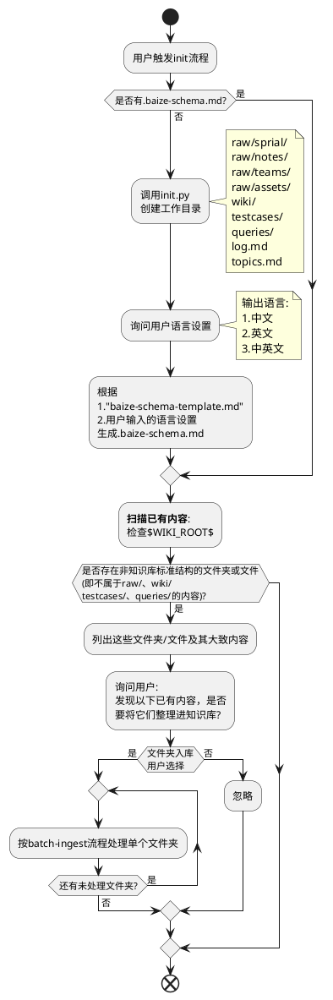
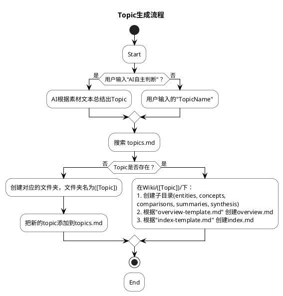
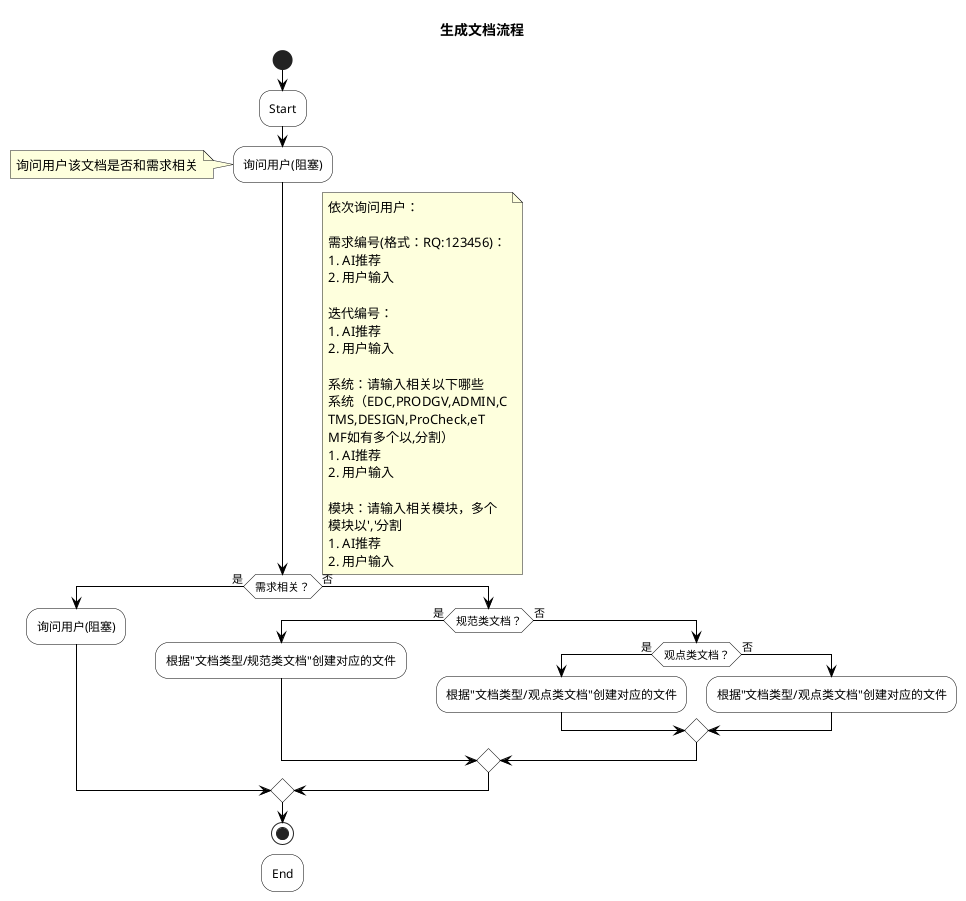
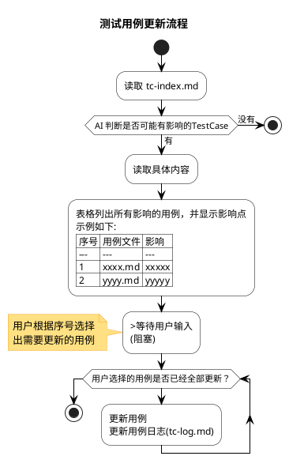
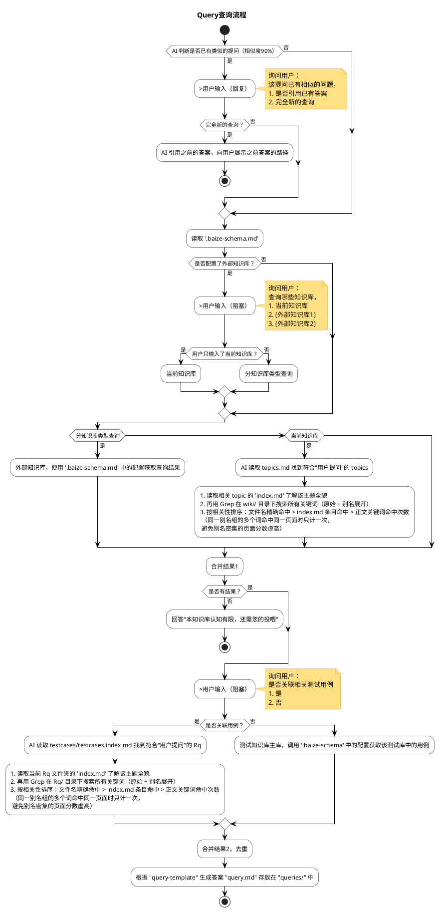
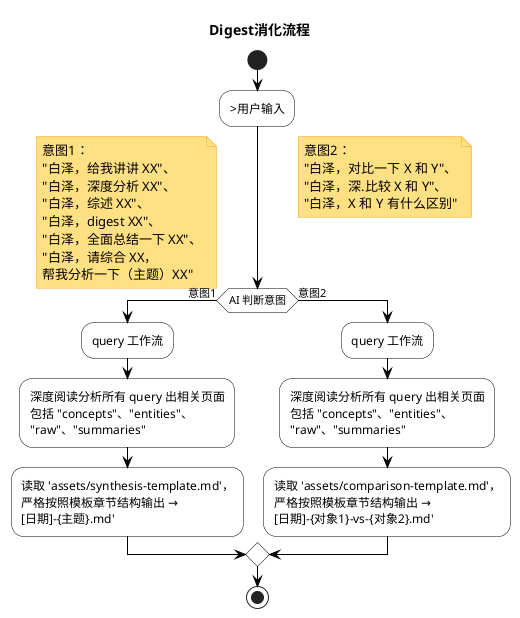

## SKILL 定义

### 目标

edk-baize 帮你构建持续成长的测试知识库，而是一个让 AI 帮你维护的 wiki 系统：

你给素材（链接、文件、文本），AI 提取核心知识并整理成互相链接的 wiki 页面
知识库随着每次使用变得越来越丰富，而不是每次重新开始
所有内容都是本地 markdown 文件，用 Obsidian 或任何编辑器都能查看

### SKILL 名： edk-baize

### 快速开始

告诉用户这两步就够了：
  初始化：说"白泽，帮我初始化一个知识库"
  添加素材：给一个链接或文件，说"白泽，帮我消化这个知识"

## 目录结构：

```
   $WIKI_ROOT/"
   ├── raw/        （原始素材）"
   │   ├── sprial/      sprial上的内容"
   │   ├── notes/       自己整理的片段笔记"
   │   ├── teams/       Teams 的聊天片段"
   │   └── assets/       图片等附件，提供给其它引用"
   ├── wiki/       （知识库）"
   │   ├── {topicName}/        文件名来自 topics.md"
   │         ├── overview.md    简要描述该topic的内容，目标，方向"
   │         ├── index.md       该topic的索引目录"
   │         ├── entities/      实体文件夹"
   │         ├── concepts/      抽象文件夹"
   │         ├── comparisons/   对比文件夹"
   │         ├── summaries/     素材摘要"
   │         ├── synthesis/     主题分析"
   ├── queries / 知识查询结果
   ├── testcases / 生成的测试用例
   │   ├── testcases.index.md 测试用例的索引文件
   │   ├── {RqNo}/        文件名来自 需求编号 文件夹命名格式'RQ{number}'"
   │         ├── overview.md    简要描述该需求的测试内容"
   │         ├── index.md       该用例的索引目录，描述用例集测试的功能"
   │         ├── {功能描述名}.ts.md       测试用例集文件"
   │         ├── {测试功能点}.tc.md       测试用例文件"
   ├── log.md      （操作日志,记录所有操作了文件的变更记录，时间线）"
   ├── topics.md  （整体的目录）"
   ├── .baize-cache.json （缓存）"
   └── .baize-schema.md （配置规范）"
```

## 工作流定义

### init 工作流
初始化知识库
工作流程如下：



### ingest 工作流
**触发**：
触发的语义："白泽，请帮我消化XXXX" 或者 "白泽，请帮我把xxxx加入到知识库" 
**目标** 消化一条素材到知识库

主要工作流程如下：
```plantuml
@startuml
skinparam backgroundColor #ffffff
skinparam handwritten false
skinparam defaultFontName "Microsoft YaHei"
skinparam activityBackgroundColor #ffffff
skinparam activityBorderColor #000000
skinparam activityArrowColor #000000
skinparam diamondBackgroundColor #ffffff
skinparam diamondBorderColor #000000
skinparam noteBackgroundColor #ffe082
skinparam noteBorderColor #f9a825

title **素材Ingest完整流程**

start

:读取 '$WIKI_ROOT/.baize-schema.md'，确定输出语言;

if (素材是否在工作区间内？) then (否)
  :A.非工作区素材迁移;
else (是)
  if (是否知识库文件夹？) then (否)
    :B.工作区素材迁移;
  else (是)
  endif
endif

:判断素材类型;

if (判断素材类型) then (文件)
  :内容提取（文件）;
else (纯文本)
  :内容提取（纯文本）;
endif

:>询问用户确定文档类型;

note right
  询问用户：
  1. AI自主判断
  2. 规范类文档
  3. 观点类文档
  4. 培训类文档
end note

:读取 topics.md;

if (文件不存在？) then (是)
  :>用户输入（阻塞）;
  note right
  询问用户：
   1.AI自主判断
   2.自定义（用户直接输入Topic名）
  end note
else (否)
  if (文件内容为空？) then (是)
    :>用户输入（阻塞）;
    note left
    询问用户：
     1.AI自主判断
     2.自定义（用户直接输入Topic名）
    end note
  else (否)
    :>用户输入2（阻塞）;
    note right
    返回用户：
      1. AI自主判断
      2. 自定义（用户直接输入Topic名）
      3. {{Topic1Name}}
      4. {{Topic2Name}}
      5. {{Topic3Name}}
    end note
  endif
endif


:C.topic生成流程;

:D.生成文档流程;

:'Lnit' 更新的topic;

:E.测试用例更新流程;

:更新 log;

:展示结果
(根据 .baize-schema.md 中的 WIKI_LANG 输出)
=====
已消化：(素材标题)

新增页面：
- [素材概要页]
- [新媒体页1]
- [新主题页1]

更新页面：
- [已有实体页2]（追加了新信息）

发现关联：
- 这篇素材和 [[已有素材]] 在 [某概念] 上有联系

更新测试用例：
- 更新 [用例B]

别名建议：（仅当发现新的同义词关系时显示）
- 建议添加同义词词表：[术语A] = [术语B]
...;

stop
@enduml
```


#### A.工作区素材迁移
a.若素材来自工作区内其他位置（如 Clippings/）：将文件**移动**到 `raw/` 对应子目录（⛔ 移动 = 复制到目标 + 删除源文件，不可只复制不删除）
b. 若素材为用户纯文本粘贴：将内容保存为 `raw/notes/{日期}-{短标题}.md`
c. 若素材包含图片引用：将图片文件**移动**到 `raw/assets/`（⛔ 同上，必须删除源位置的图片文件）
d. ⛔ 确保溯源来源链接指向的 raw/ 文件确实存在，否则立即创建
e. ⛔ 源文件清理检查： 完成后，必须验证原始位置的文件已被删除；若源目录变为空目录，一并删除该空目录

#### B.非工作区素材迁移
```python
py(或python3) scripts/import_external.py <wiki_root> <source_path> [--subdir <类型>]
```

脚本会自动完成：复制文件到 raw/、扫描图片引用、搜索并复制图片到 raw/assets/。
根据脚本输出的 JSON 报告，若有 `images_missing` 则在后续摘要页中标注 `[图片缺失: 文件名]`

#### C.topic生成流程



#### D.文档生成流程



#### E.测试用例更新流程



### batch-ingest 工作流
**触发**：
触发的语义："白泽，请把当前文件夹整理进入知识库"或者说"白泽，请把{文件夹路径}整理进入知识库"。
**核心原则**：
1. 使用ingest流程消化多条素材到知识库
2. 顺序执行，不用并发执行


### lint 工作流

**触发**：
- 触发的语义："白泽，请检查知识库"
- 每次 ingest / batch-ingest 完成后自动执行

⛔ **以下所有检查项都很重要，不可遗漏任何一项。每次 lint 必须逐项执行并报告结果。**

#### 脚本检查

```
py scripts/lint_runner.py <wiki_root> [topic]
```

⛔ 检查项（全部必须执行）：
- [ ] **孤立页面**：entities/ 下没有被其他页面引用的实体
- [ ] **断链**：`[[X]]` 链接指向的 X.md 不存在
- [ ] **index 一致性**：index.md 里有记录但文件缺失的条目

#### AI 补充检查

⛔ 检查项（全部必须执行，不可跳过任何一项）：
- [ ] **矛盾信息**：阅读相关页面，检查是否有互相矛盾的说法
- [ ] **交叉引用缺失**：检查相关主题的页面之间是否应该互相链接但没链
- [ ] **置信度报告**：统计 EXTRACTED / INFERRED / AMBIGUOUS / UNVERIFIED
- [ ] **溯源来源格式检查**：
  - summaries 页：必须是 `[[raw/{subdir}/{文件名}|显示名]]` 格式（Obsidian wiki link），⛔ 发现纯文本或相对路径 `[](../...)` 则报错
  - concepts / entities 页：必须是 `[[摘要页名]]` 格式，⛔ 发现纯文本或相对路径则报错
- [ ] **规范类文档结构完整性检查**（⛔ 仅当摘要页 doc_type 为"规范类"时执行，但不可遗漏）：
  - 检查摘要页的"文档结构"章节中，每个主要章节是否都有 `[[概念页名]]` 链接
  - ⛔ 发现无链接的章节条目则报错，提示需要创建对应概念页或补充链接
  - 检查链接指向的概念页文件是否实际存在
- [ ] **培训类文档模块完整性检查**（⛔ 仅当摘要页 doc_type 为"培训类"时执行，但不可遗漏）：
  - 检查摘要页的"知识模块"章节中，每个模块是否都有 `[[概念页名]]` 链接
  - 检查"学习目标"中的每项能力是否有对应的概念页覆盖
  - 检查链接指向的概念页文件是否实际存在
- [ ] **源文件清理检查**：确认 raw/ 以外不存在应已被移动的源文件残留
- [ ] **过时检测**：对比每个摘要页面的 updated 的日期和对应raw素材的修改时间,如果raw素材更新了但wiki没更新，标记为“可能过时”

#### 输出报告

⛔ 报告必须逐项列出每个检查项的结果（✅ 通过 / ❌ 失败 / ⚠️ 警告），不可笼统概括。

输出中文报告，询问是否自动修复。报告包含：
- 每个检查项的逐项结果
- 孤立页面及建议链接
- 断链及建议创建
- 矛盾信息及来源
- 缺失索引条目
- 溯源来源格式错误清单
- 文档结构/知识模块链接缺失清单
- 置信度统计

### query 工作流
**触发**：
触发的语义："白泽，我想查询XXX相关内容"或者说"白泽，你知道XXXX吗?"。

⛔ **核心原则**：
- 知识必须来源于知识库中已有的页面，可引用 '.baize-schema.md' 中定义的外部知识库
- 不可编造，不可臆断，不可补充知识库中没有的内容
- 存疑、不确定、无法从知识库中明确得出的内容，必须放在"待酌"章节
- 读取相关页面，综合回答，回答中标注来源页面，不可自我加工

工作流程



### digest
**触发**：
触发语义："白泽, 给我讲讲 XX"、"白泽，深度分析 XX"、"白泽，对比一下 X 和 Y"

区别于 query：query 是快速问答生成到 queries/；digest 是跨素材深度综合，生成到 synthesis/ 或 comparisons/。

⛔ **核心原则**：
- 知识必须来源于知识库中已有的页面，不可引用知识库外的信息
- 不可编造，不可臆断，不可补充知识库中没有的内容
- 存疑、不确定、无法从知识库中明确得出的内容，必须放在"待酌"章节
- 对相关页面进行深度分析和解读

工作流程：



## 文档类型
- A. **规范类文档**（标准规范、需求、API 文档、技术手册、协议定义——有编号体系、有 Required/Optional 约束、有逐项定义）
- B. **观点类文档**（文章、博客、讨论、笔记、报道——表达观点、经验、分析）
- C. **培训类文档**（教程、课程、操作指南、培训材料——教授如何做某事）

### 摘要页(summaries)通用约束
填充内容到 `wiki/{Topic}/summaries/`。
⛔ 规范类：核心观点必须按章节逐一覆盖；"文档结构"章节每个主要章节后必须有 `[[概念页链接]]`。
⛔ 培训类："知识模块"章节每个模块后必须有 `[[概念页链接]]`。
⛔ 溯源来源格式：`[[raw/{subdir}/{文件名}|显示名]]`（Obsidian wiki link），禁止纯文本或相对路径链接。
⛔ 每个关键事实后面标注来源：`([[raw/{subdir}/{文件名}|源文, L42-45]])`
⛔ 数字和结论必须原文引用**
     不要用 AI 的话重述数字。直接引用原文。
     差：该公司营收约 10 亿
     好：该公司营收"10.3 亿元"(raw/report.md, L128)

### 内容处理通用约束
- 必须先读取 `assets/concept-template.md`，严格按模板章节结构输出
   - 底部关联章节必须使用"相关实体 → 关联概念 → 溯源来源"，禁止替换为"相关页面"
   - 溯源来源格式：`[[摘要页名]]`（禁止纯文本或相对路径）
   - ⛔ **合并判断必须询问用户**：遇到多章节合并、内容拆分、与已有页面重叠时，必须暂停展示方案，等待用户决定后才继续。格式：
     ```
     ⚠️ 合并判断：
     - 方案 A：...
     - 方案 B：...
     请选择。
     ```

### 规范类文档
#### 摘要页 
1. 读取 `assets/summary-spec-template.md`
2. **必须遵守 “摘要页(summaries)通用约束**
#### 内容处理
（⛔ 不可用观点类的"提炼几个要点"方式处理）：
   - 规范的每个章节都是独立的知识单元，必须为每个主要技术模块创建独立概念页
   - 概念页中应包含该元素/机制的完整属性表、业务规则、使用约束
   - 不适用简化处理（规范类文档通常都 > 1000 字）
   - 处理步骤：
     1. 按文档大纲，为每个主要章节/元素确定需要创建的概念页列表
     2. 逐一创建概念页（读取 `assets/concept-template.md`）
     3. 检查是否需要创建实体页（读取 `assets/entity-template.md`）
     4. 更新 `wiki/{Topic}/overview.md`
   - **必须遵守'内容处理通用约束'**
   
   
   
### 观点类文档
#### 摘要页 
1. 读取 `assets/summary-template.md`
2. **必须遵守 “摘要页(summaries)通用约束**
#### 内容处理
- **完整处理**（素材 > 1000 字）：
    1. 提取 3-10 个关键概念
    2. 检查是否需要创建新的实体页（读取 `assets/entity-template.md`）
    3. 检查是否需要创建或更新概念页（读取 `assets/concept-template.md`），围绕"思想/方法论/模式"创建
    4. 更新 `wiki/{Topic}/overview.md`（如果知识库全貌有变化）
- **简化处理**（素材 < 1000 字）：
    1. 提取 1-3 个关键概念
    2. 如果关键概念已有页面，追加信息；否则标记 `[待创建]`
    3. 跳过概念页和 overview 更新
- **必须遵守'内容处理通用约束'**

### 培训类文档
#### 摘要页 
1. 读取 `assets/summary-training-template.md`
2. **必须遵守 “摘要页(summaries)通用约束**
#### 内容处理
- **完整处理**（素材 > 1000 字）：
     1. 按知识模块提取关键概念
     2. 概念页围绕以下类型创建：
        - **操作流程页**：完整的步骤序列
        - **最佳实践页**：从教程中提炼的推荐做法
        - **常见问题页**：教程中提到的坑和解决方案
        - **工具/命令页**：关键工具的用法速查
     3. 可适度压缩相似步骤，但不可丢失关键操作细节
     4. 更新 `wiki/{Topic}/overview.md`
- **简化处理**（素材 < 1000 字）：
     1. 提取 1-3 个关键操作/知识点
     2. 如果已有页面，追加信息；否则标记 `[待创建]`
     3. 跳过概念页和 overview 更新
- **必须遵守'内容处理通用约束'**

## 页面命名规范

- 实体页：`wiki/{topicName}/entities/{名称}.md`
- 概念页：`wiki/{topicName}/concepts/{概念名}.md`
- 素材摘要：`wiki/{topicName}/summaries/{日期}-{短标题}.md`
- 对比分析：`wiki/{topicName}/comparisons/{对比主题}.md`
- 综合分析：`wiki/{topicName}/synthesis/{分析主题}.md`
- 主题总览：`wiki/{topicName}/overview.md`
- 主题索引：`wiki/{topicName}/index.md`

## 交叉引用规范

- 页面间使用 `[[页面名]]` 语法（Obsidian 兼容的双向链接）
- 素材引用格式：`[来源: 素材标题](../summaries/xxx.md)`
- 每个页面底部维护对应模板定义的关联章节

## 底部关联章节（按页面类型区分）

不同类型的页面使用不同的底部关联章节，**以对应模板为准**：

- **concept 页**：`## 相关实体` → `## 关联概念` → `## 溯源来源`
- **entity 页**：`## 关联概念` → `## 相关实体` → `## 溯源来源`
- **summary 页**：`## 与其他素材的关联` → `## 原文精彩摘录` → `## 相关页面` → `## 溯源来源`
- **synthesis 页**：`## 涉及概念` → `## 参考资料`
- **comparison 页**：`## 关联链接` → `## 相似的对比`
- **overview / index 页**：无强制底部关联章节

## 别名词表（Alias Table）

用于 query 和 digest 时自动展开搜索。AI 在 ingest 时如果发现新的同义词关系，应主动建议用户添加到 `.wiki-schema.md` 中。

维护原则：
- 只收录知识库里实际出现过的同义词
- 每组控制在 5 个以内
- 中英文混用时把最常用的放第一个