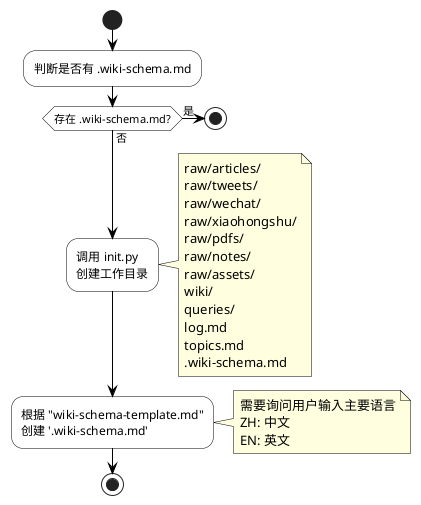
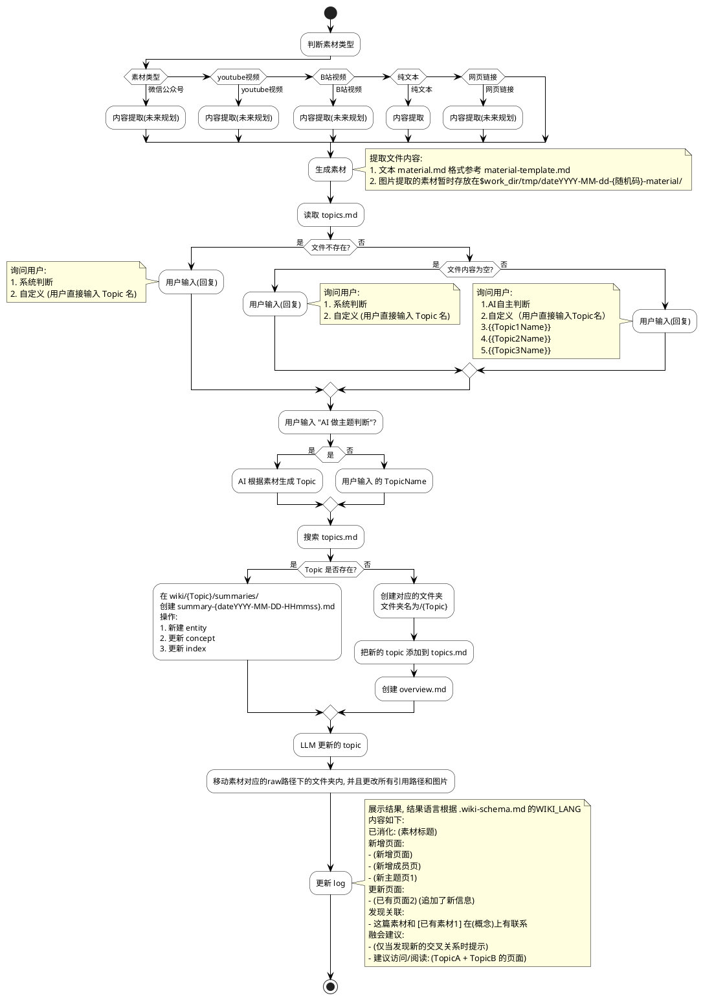
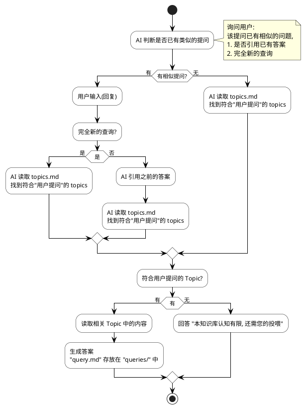

## SKILL 定义
### 目标
llm-wiki 帮你构建一个持续增长的个人知识库。它不是传统的笔记软件，而是一个让 AI 帮你维护的 wiki 系统：

你给素材（链接、文件、文本），AI 提取核心知识并整理成互相链接的 wiki 页面
知识库随着每次使用变得越来越丰富，而不是每次重新开始
所有内容都是本地 markdown 文件，用 Obsidian 或任何编辑器都能查看

### Skill 名： red-llm-wiki
### 存放路径： ${WORK_DIR}/skills
### 快速开始
告诉用户这两步就够了：
  初始化：说"帮我初始化一个知识库"
  添加素材：给一个链接或文件，说"帮我消化这篇"
## 目录结构：
```
   $WIKI_ROOT/"
   ├── raw/        （原始素材）"
   │   ├── articles/     网页文章"
   │   ├── tweets/       X/Twitter"
   │   ├── wechat/       微信公众号"
   │   ├── xiaohongshu/  小红书"
   │   ├── zhihu/        知乎"
   │   ├── pdfs/         PDF"
   │   ├── notes/        笔记"
   │   └── assets/       图片等附件，提供给其它引用"
   ├── wiki/       （知识库）"
   │   ├── {topicName}/        文件名来自 topics.md"
   │         ├── overview.md    简要描述该topic的内容，目标，方向"
   │         ├── index.md       该topic的索引目录"
   │         ├── entities/      实体文件夹"
   │         ├── concepts/      抽象文件夹"
   │         ├── comparisons/   对比文件夹"
   │         ├── summaries/     素材摘要"
   │         ├── synthesis/     主题分析"
   ├── queries / 存储查询结果         
   ├── log.md      （操作日志,记录所有操作了文件的变更记录，时间线）"
   ├── topics.md  （研究方向）"
   ├── .wiki-cache.json （缓存）"
   └── .wiki-schema.md （配置规范）"
```

## 工作流定义

### init
初始化知识库
工作流程如下



### ingest 
触发条件：用户给一个素材进来。
1. 消化一条素材到知识库
2. lint 更新的 topic
处理流程如下：


### batch-ingest
触发条件：当用户给了一个文件夹路径，或者说"把这些都整理一下"。
1. 使用ingest流程消化多条素材到知识库
2. 顺序执行，不用并发执行
2. lint 所有更新的 topic

### query
功能查询知识库
相关的工作流程：



### lint
触发条件（以下任意条件）：
1.用户主动说"检查知识库"
2.每次 ingest 后，如果素材总数是 10 的倍数，主动建议运行 lint

健康检查，检查过程包括

#### 脚本检查 
- 检查脚本 
```
py ${SKILL_DIR}/scripts/lint_runner.py ${topic}
```
- 脚本功能
 - 孤立页面（entities/ 下没有被其他页面引用的实体）
 - 断链（[[X]] 链接指向的 X.md 不存在，支持 [[X|别名]] 语法）
 - index 一致性（index.md 里有记录但文件缺失的条目）

#### AI检查
 - 矛盾信息（阅读相关页面，检查是否有互相矛盾的说法）：
   - 列出发现的矛盾
   - 标注每处矛盾的来源页面

 - 交叉引用缺失（检查相关主题的页面之间是否应该互相链接但没链）：
   - 建议添加的交叉引用

 - 置信度报告（统计 EXTRACTED / INFERRED / AMBIGUOUS / UNVERIFIED）：
   - 高亮 AMBIGUOUS 条目，提醒用户优先验证
   - 抽查标注为 EXTRACTED 的条目，检查是否能在原始素材里找到对应原文
   - 如果发现 EXTRACTED 无法回溯到原文，提示用户回退为更低置信度或重新整理

#### 输出报告

知识库健康检查报告

检查范围：最近更新 10 页 + 随机抽查 10 页（共 {N} 页）

孤立页面（没有其他页面链接到它）：
- [[某页面]] → 建议从 [[相关页面]] 添加链接

断链（被链接但不存在）：
- [[某概念]] → 建议创建新页面

矛盾信息：
- 关于"XX"，[[页面A]] 说是 Y，但 [[页面B]] 说是 Z

缺失索引：
- {文件名} 存在但未记录在 index.md 中

置信度报告：
- EXTRACTED：{N}
- INFERRED：{N}
- AMBIGUOUS：{N}
- UNVERIFIED：{N}

### digest(深度综合报告)
区别于 query：query 是快速问答，生成内容到queries；digest 是跨素材深度综合，生成路径在 synthesis 或 comparisons
触发条件：
1.默认深度报告格式："给我讲讲 XX"、"深度分析 XX"、"综述 XX"、"digest XX"、"全面总结一下 XX"， "请结合XX，帮我分析一下 {主题}"
2.对比表格式："对比一下 X 和 Y"、"比较 X 和 Y"、"X 和 Y 有什么区别"
工作流程：
```plantuml
@startuml
' 样式配置
skinparam activity {
  BackgroundColor White
  BorderColor Black
  ArrowColor Black
  FontName "Microsoft YaHei"
}
skinparam note {
  BackgroundColor LightYellow
  BorderColor Black
}

start

:用户输入;
:AI提取问题中的Topic;

if (Topic是否存在?) then (不存在)
  :提示:\n"本知识库知识有限，还需要您的投喂";
else (存在)
  :AI判断用户意图;

  note left of 意图1
    意图1:
    "给我讲讲 XX"、"深度分析 XX"、"综述 XX"、"digest XX"、"全面总结一下 XX",
    "请结合XX，帮我分析一下 {主题}"
  end note

  note right of 意图2
    意图2:
    "对比一下 X 和 Y"、"比较 X 和 Y"、"X 和 Y 有什么区别"
  end note

  if (用户意图) then (意图1)
    :读取topic下的内容，\n生成 {日期}-{主题}.synthesis.md;
  else (意图2)
    :读取topic下的内容，\n生成 {日期}-{对比对象1}-vs-{对比对象2}.comparison.md,文件存放在{对比对象1的路径下};
  endif
endif

stop
@enduml
```

## 模板定义


1. 请根据下面的模板定义创建模板，输出路径 "${SKILL_DIR}/template/${templateName}.md"
2. 再根据各个模板创建出范例 输出路径 "${SKILL_DIR}/template/${templateName}-example.md"

### topics.md

```markdown
---
created: {{date:YYYY-MM-DD HH:mm:ss}}
updated: {{date:YYYY-MM-DD HH:mm:ss}}
---
# {{TOPIC_NAME1}}
> 一句话概括这个主题的核心问题或方向
# {{TOPIC_NAME2}}
> 一句话概括这个主题的核心问题或方向

```


### topic-template.md
```
---
tags: [主题]
created: {{date:YYYY-MM-DD HH:mm:ss}}
updated: {{date:YYYY-MM-DD HH:mm:ss}}
sources: []
---

# {{TOPIC_NAME}}

> 一句话概括这个主题的核心问题或方向

## 核心观点

（从多个素材中综合出来的关于这个主题的核心认知）

## 素材汇总

（列出所有讨论过这个主题的素材，标注每篇的核心贡献）

| 素材 | 核心贡献 | 详见 |
|------|----------|------|
| （素材名） | （一句话） | [[素材摘要页]] |

## 关键概念

（这个主题涉及的关键概念，链接到对应实体页）

- [[概念1]] — 简要说明
- [[概念2]] — 简要说明

## 未解决的问题

（素材中提到但没有答案的问题，或素材之间存在矛盾的地方）

## 相关页面
```

### entity-template.md
```
---
tags: [实体]
created: {{date:YYYY-MM-DD HH:mm:ss}}
updated: {{date:YYYY-MM-DD HH:mm:ss}}
sources: []
---

# {{ENTITY_NAME}}

> 一句话描述这个实体是什么

## 简介

（这个实体的基本介绍）

## 关键信息

- **类型**：（人物 / 组织 / 论文 / 工具 / 事件 / 产品）
- **领域**：（所属领域）

## 详细内容
（从素材中提取的关于这个实体的详细信息）
### 核心特征
### 关键能力
### 发展历程


## 不同素材中的观点

（不同素材对同一个实体的不同描述或评价，标注来源）

## 关联概念
## 相关实体
## 溯源来源
```

### concept-template.md
```
---
tags: [抽象概念]
created: {{date:YYYY-MM-DD HH:mm:ss}}
updated: {{date:YYYY-MM-DD HH:mm:ss}}
sources: []
---

# {{CONCEPT_NAME}}

> 一句话描述这个抽象概念是什么

## 简介

（这个抽象概念的基本介绍）

## 关键信息

- **类型**：（抽象理论 / 专业术语 / 方法论 / 架构范式 / 思想原理 / 技术流派）
- **领域**：（所属领域）
- **相关概念**：（关联的其他实体）

## 详细内容

（从素材中提取的关于这个抽象概念的详细信息）
### 定义
### 核心原理
### 关键要素
### 适用场景
### 优缺点

## 不同素材中的观点

（不同素材对同一个实体的不同描述或评价，标注来源）

## 相关实体
## 关联概念
## 溯源来源
```

### index-template.md

```
# 知识库索引

> 最后更新：{{date:YYYY-MM-DD HH:mm:ss}}

---

## 概览

- 主题：{{TOPIC}}
- 素材总数：0
- Wiki 页面总数：0

---

## 实体

> 具体、具象、可唯一标识的真实对象（人物、公司、AI模型、开源项目、框架、产品、论文、知名工具）

（暂无）

---

## 抽象主题

> 抽象理论、专业术语、方法论、架构范式、思想原理、技术流派（算法原理、学习范式、架构设计、思维方法、行业通用理论）

{{实体名}}

---

## 素材摘要

> 每个消化过的素材都有一篇摘要

（暂无）

---

## 对比分析

> 对比不同方案、工具、观点

（暂无）

---

## 综合分析

> 跨素材的深度分析

（暂无）
```

### overview-template.md

```
# {{TOPIC}} — 知识库总览

> 创建于 {{date:YYYY-MM-DD HH:mm:ss}}

---

## 关于这个知识库

这里收集了关于 **{{TOPIC}}** 的所有知识和素材。

每个素材都经过 AI 消化和整理，形成了互相链接的 wiki 页面。你可以通过以下方式浏览：

- **实体页**：人物、组织、概念、工具的详细介绍
- **抽象概念页**：围绕某个研究主题的综合分析
- **素材摘要**：每篇素材的核心观点提取
- **对比分析**：不同方案、工具、观点的横向比较
- **主题分析**：根据用户提供的主题，根据知识库中的知识的深度洞察

---

## 知识地图

（随着素材积累，这里会展示知识库覆盖的主要方向）

---

## 最近更新
（最近更新5条内容，包括 entity, concept, summaries, comparisons）
[[]]
（暂无）
```

### comparison-template.md
```
---
tags: [对比分析]
created: {{date:YYYY-MM-DD HH:mm:ss}}
updated: {{date:YYYY-MM-DD HH:mm:ss}}
sources: []
---

# Compare： {{对比对象1}} VS {{对比对象2}}

> 创建于 {{date:YYYY-MM-DD HH:mm:ss}}

---

## 对比维度

| 维度 | {{对比对象1}} | {{对比对象2}} |
|------|--------------|---------------|


---

## 核心结论


---

## 关联链接
[[对比对象1]]
[[对比对象2]]

## 相似的对比
[[对比1]]
[[对比2]]
```

### summary-template.md
```
---
tags: [素材摘要]
created: {{date:YYYY-MM-DD HH:mm:ss}}
updated: {{date:YYYY-MM-DD HH:mm:ss}}
sources: []
source_type: {{TYPE}}
source_path: {{RAW_PATH}}
images: 0
image_paths: []
---

# {{SUMMARY_TITLE}}

> 一句话总结这篇素材的核心观点

## 基本信息

- **来源类型**：{{TYPE}}（文章 / 推文 / 公众号 / PDF / 笔记 / 视频）
- **原文位置**：{{RAW_PATH}}
- **消化日期**：{{date:YYYY-MM-DD HH:mm:ss}}

## 核心观点

（3-5 个要点，每个要点用 1-2 句话说清楚）

1. **要点一**：...
2. **要点二**：...
3. **要点三**：...

## 关键概念

（素材中提到的重要概念，链接到或标注需要创建的实体页）

- [[概念1]]
- [[概念2]]

## 与其他素材的关联

（这篇素材和已有素材之间有什么联系？是补充、反驳、还是扩展？）

- 与 [[另一篇素材]] 的关系：...

## 原文精彩摘录

（值得原样保留的 2-3 段原文）

> 摘录一...

> 摘录二...

## 相关页面
```


### synthesis-template.md
```
---
tags: [主题分析]
created: {{date:YYYY-MM-DD HH:mm:ss}}
updated: {{date:YYYY-MM-DD HH:mm:ss}}
sources: []
confidence: INFERRED
---

# {{TOPIC}} 主题分析

## 核心洞见

<!-- 3-5 条关键洞见，每条一行 -->

## 关键决策

<!-- 做了什么决定，为什么这么决定 -->

## 涉及概念

<!-- 列出本次会话涉及的重要概念，每个用 [[概念名]] 格式链接 -->

## 参考资料

<!-- 对话中提到的文章、工具、项目 -->

## 待跟进

<!-- 还没解决的问题，或者下一步要验证的假设 -->

## 历史 （如果有相同的总结，比如多次说"深度分析 XX"）
[[历史]]
``` 

### query-template.md

```
---
type: query
derived: true
title: "{{TITLE}}"
created: {{date:YYYY-MM-DD HH:mm:ss}}
updated: {{date:YYYY-MM-DD HH:mm:ss}}
tags: [{{TAGS}}]
sources: [{{SOURCES}}]
related: [{{RELATED}}]
---

## 问题
{{QUESTION}}

## 回答
{{ANSWER}}

## 引用来源
{{SOURCE_LINKS}}

```

### log-entry-template.md

```
## {{date:YYYY-MM-DD HH:mm:ss}} - {{操作类型}}

- **操作**：{{ingest / lint / query / init}}
- **素材**：{{素材标题}}（仅 ingest 时填写）
- **Topic**：{{topicName}}
- **变更**：
  - 新增：{{新增页面列表}}
  - 更新：{{更新页面列表}}
- **备注**：{{可选备注}}
```

### material-template.md

```
---
type: material
created: {{date:YYYY-MM-DD HH:mm:ss}}
updated: {{date:YYYY-MM-DD HH:mm:ss}}
sources: {{url}} (如果是 URL 类素材)
---
## 文本
{{文本内容}}
## 图片素材
- [[image_path1]]
- [[image_path2]]
```


### wiki-schema-template.md
```
# Wiki Schema（知识库配置规范）

> 这个文件告诉 AI 如何维护你的知识库。你和 AI 可以一起调整它。

## 知识库信息
- 创建日期：{{date:YYYY-MM-DD HH:mm:ss}}
- 语言：{{LANGUAGE}}
- 版本：1.1

## 目录结构


$WIKI_ROOT/"
   ├── raw/        （原始素材）"
   │   ├── articles/     网页文章"
   │   ├── tweets/       X/Twitter"
   │   ├── wechat/       微信公众号"
   │   ├── xiaohongshu/  小红书"
   │   ├── zhihu/        知乎"
   │   ├── pdfs/         PDF"
   │   ├── notes/        笔记"
   │   └── assets/       图片等附件，提供给其它引用"
   ├── wiki/       （知识库）"
   │   ├── {topicName}/        文件名来自 topics.md"
   │         ├── overview.md    简要描述该topic的内容，目标，方向"
   │         ├── index.md       该topic的索引目录"
   │         ├── entities/      实体文件夹"
   │         ├── concepts/      抽象文件夹"
   │         ├── comparisons/   对比文件夹"
   │         ├── summaries/     素材摘要"
   │         ├── synthesis/     主题分析"
   ├── queries / 存储查询结果         
   ├── log.md      （操作日志,记录所有操作了文件的变更记录，时间线）"
   ├── topics.md  （研究方向）"
   ├── .wiki-cache.json （缓存，未来规划）"
   └── .wiki-schema.md （配置规范）"

## 页面命名规范

- 实体页：`wiki/{topicName}/entities/{名称}.md`
  - 例：`wiki/大语言模型/entities/Transformer.md`、`wiki/AI编程工具/entities/Cursor.md`
- 概念页：`wiki/{topicName}/concepts/{概念名}.md`
  - 例：`wiki/大语言模型/concepts/注意力机制.md`
- 素材摘要：`wiki/{topicName}/summaries/{日期}-{短标题}.md`
  - 例：`wiki/大语言模型/summaries/2026-04-05-karpathy-llm-wiki.md`
- 对比分析：`wiki/{topicName}/comparisons/{对比主题}.md`
  - 例：`wiki/AI编程工具/comparisons/Cursor-vs-Copilot.md`
- 综合分析：`wiki/{topicName}/synthesis/{分析主题}.md`
  - 例：`wiki/大语言模型/synthesis/AI工具选型建议.md`
- 主题总览：`wiki/{topicName}/overview.md`
- 主题索引：`wiki/{topicName}/index.md`

## 交叉引用规范

- 页面间使用 `[[页面名]]` 语法（Obsidian 兼容的双向链接）
- 素材引用格式：`[来源: 素材标题](../summaries/xxx.md)`
- 每个页面底部维护"相关页面"列表

## 页面格式规范

每个 wiki 页面应包含：


---
tags: [标签1, 标签2]
created: YYYY-MM-DD
updated: YYYY-MM-DD
sources: [关联素材列表]
---

# 页面标题

> 一句话摘要

## 正文内容

...

## 相关页面

- [[另一个页面]]
- [[又一个页面]]


## Ingest（消化素材）规则

### 分级处理

根据素材长度和信息密度自动分级：

**完整处理**（素材 > 1000 字）：
1. 每个新素材**必须**生成摘要页（`wiki/{topicName}/summaries/` 下）
2. 从素材中提取 3-5 个关键概念
3. 检查是否需要创建新的实体页（`wiki/{topicName}/entities/`）
4. 检查是否需要创建或更新概念页（`wiki/{topicName}/concepts/`）
5. 更新 `wiki/{topicName}/index.md`（添加新条目）
6. 更新 `log.md`（记录操作）
7. 更新 `wiki/{topicName}/overview.md`（如果知识库全貌有变化）

**简化处理**（素材 < 1000 字，如短推文、小红书笔记）：
1. 生成摘要页（`wiki/{topicName}/summaries/` 下）
2. 提取 1-3 个关键概念
3. 如果关键概念已有实体页，追加信息；如果没有，在摘要页中标记 `[待创建]`
4. 更新 `wiki/{topicName}/index.md` 和 `log.md`
5. 跳过概念页和 overview 更新

### 来源边界

这套边界和安装输出、状态说明、回归测试保持一致。

| 分类 | 当前来源 | 处理原则 |
|------|----------|----------|
| 核心主线 | `PDF / 本地 PDF`、`Markdown/文本/HTML`、`纯文本粘贴` | 不依赖外挂，直接进入主线 |
| 可选外挂 | `网页文章`、`X/Twitter`、`微信公众号`、`YouTube`、`知乎` | 先自动提取；失败时退回手动入口 |
| 手动入口 | `小红书` | 只接受用户手动粘贴 |

### 素材类型路由

| 来源 | raw 目录 | 提取方式 |
|------|----------|----------|
| 网页文章 | `raw/articles/` | baoyu-url-to-markdown skill |
| X/Twitter | `raw/tweets/` | baoyu-url-to-markdown skill（需 Chrome 登录） |
| 微信公众号 | `raw/wechat/` | wechat-article-to-markdown |
| YouTube | `raw/articles/` | youtube-transcript skill |
| B站视频 | `raw/articles/` | 未来规划 |
| 小红书 | `raw/xiaohongshu/` | 用户手动粘贴内容 |
| 知乎 | `raw/zhihu/` | 用户手动粘贴内容 或 baoyu-url-to-markdown skill |
| PDF / 本地 PDF | `raw/pdfs/` | 直接读取 |
| Markdown/文本/HTML | `raw/notes/` | 直接读取 |
| 纯文本粘贴 | `raw/notes/` | 直接使用 |

## 别名词表（Alias Table）

用于 query 和 digest 时自动展开搜索。搜索任意一个词，会同时搜索同一行的所有别名。
AI 在 ingest 时如果发现新的同义词关系，可以建议用户添加。

格式：每行一组同义词，用 `=` 分隔。


LLM = 大语言模型 = 大模型 = Large Language Model
RAG = 检索增强生成 = Retrieval Augmented Generation
fine-tuning = 微调 = 精调
prompt engineering = 提示工程 = 提示词工程


维护原则：
- 只收录在你的知识库里**实际出现过**的同义词，不要预填一堆用不到的
- 每组控制在 5 个以内，太多说明概念本身需要拆分
- 中英文混用时把最常用的放第一个
- ingest 发现新的同义词关系时，AI 应主动建议添加到此表

## Query（查询）规则

1. 先读 `index.md`，定位相关条目
2. 用 Grep 在 `wiki/` 下搜索关键词
3. 阅读相关页面后综合回答
4. 回答中标注来源页面（引用链接）
5. 有价值的分析建议保存为新的 wiki 页面

## Lint（健康检查）规则

1. 检查范围：随机抽查 10 个页面 + 最近更新的 10 个页面
2. 检查项：
   - 页面间矛盾（不同页面说法不一致）
   - 孤立页面（没有其他页面链接到它）
   - 缺失概念页（被 `[[某概念]]` 链接但实际不存在）
   - 缺少交叉引用（相关页面之间没有互相链接）
   - index 一致性（index.md 记录与实际文件是否对应）
3. 输出中文报告，对每个问题给出修复建议
4. 如果发现问题，询问用户是否自动修复

## 关系类型词汇表（未来规划，可选，用于手动标注知识图谱）

这张表提供 graph 工作流生成的 `wiki/knowledge-graph.md` 里**可选**的关系类型词汇。
AI 生成图谱时默认全部用 `-->`（无标注），不自动判断关系类型。如果你想让图谱
更清楚地表达节点之间的语义，可以用编辑器把最重要的几条箭头改写成带标注的形式：

| 类型关键词 | 含义 | Mermaid 写法示例 |
|-----------|------|-----------------|
| 实现       | A 是 B 的具体实现 | `A -->|实现| B` |
| 依赖       | A 依赖 B 才能工作 | `A -->|依赖| B` |
| 对比       | A 与 B 是同类可以比较 | `A -->|对比| B` |
| 矛盾       | A 与 B 存在观点冲突 | `A -->|矛盾| B` |
| 衍生       | A 从 B 演化而来 | `A -->|衍生| B` |

使用原则：
- 只标最重要的 3-5 条关系，不要强行给所有箭头打标
- 不确定的关系保持默认 `-->` 箭头
- 自定义类型控制在 2 个以内，避免词汇表膨胀
- 标注后在 Obsidian / VS Code（Markdown Preview Enhanced）/ Typora 里重新渲染就能看到标签
```

## refernece 定义
${SKILL_DIR} = Skill 代码目录（如 .kiro/skills/red-llm-wiki/）
${WIKI_ROOT} = 用户知识库数据目录（由用户在 init 时指定，与 Skill 代码分离）
script路径: ${SKILL_DIR}/scripts/
template路径: ${SKILL_DIR}/templates/

## python 版本定义
python 3.13