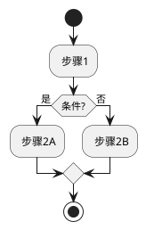

# SKILL 设计模板

> 使用说明：
> 1. 复制本文件，重命名为 `{skill-name}.design.md`，放在对应 Skill 目录下
> 2. 填写各章节内容，这是设计文档，不会被 AI 直接引用
> 3. 设计完成后，根据本文档生成正式的 SKILL.md 和 references/ 文件
> 4. 带 `<!-- -->` 的内容是填写说明，完成后可删除

---

## SKILL 定义

### 目标

<!-- 用 2-4 句话描述这个 SKILL 要解决什么问题，为谁服务，核心价值是什么。-->

### SKILL 名

<!-- 格式：kebab-case，全小写，例如 edk-baize、red-llm-wiki -->

{skill-name}

### 快速开始

<!-- 用户只需几步就能上手，写触发语义或操作步骤 -->

### 依赖

<!-- 依赖哪些外部工具、MCP、其他 SKILL、Python 版本等 -->

- Python: 3.13+
- 其他 SKILL：（无 / edk-baize / ...）
- MCP：（无 / xmind-mcp / ...）

---

## 目录结构

<!-- 定义 WIKI_ROOT 或其他数据目录的标准结构。
     如果有严格的目录规范（如 edk-baize），建议单独提取到 references/wiki-structure.md。
     如果目录结构简单，直接写在这里即可。-->

```
$DATA_ROOT/
├── SKILL.md          # Required: metadata + instructions
├── scripts/          # Optional: executable code
├── references/       # Optional: documentation
├── assets/           # Optional: templates, resources
├── {skill}.design.md # SKILL 的设计模板
├── {skill}.log.md    # SKILL 修改日志

### 核心规则

<!-- 列出禁止事项，例如：禁止增减子目录、禁止自动命名路径等 -->

---

## 工作流定义

<!-- 每个工作流一节。按以下格式填写。-->

### {工作流名称1}

**触发条件**：
<!-- 用户说什么话、或什么事件会触发这个工作流 -->

**目标**：
<!-- 这个工作流完成后，用户得到了什么 -->

**主要流程**：
<!-- 用流程图（plantuml/mermaid）或分步列表描述主要逻辑。
     重点标注：
     - ⛔ 门控步骤（必须等待用户确认才能继续）
     - 分支条件
     - 调用其他 SKILL 或脚本的地方 -->



**子流程**（如有）：
<!-- 拆分复杂流程，每个子流程单独描述 -->

---

### {工作流名称2}

<!-- 同上格式 -->

---

## 文档类型 / 数据类型

<!-- 如果 SKILL 需要处理多种类型的输入，在这里定义各类型的处理策略。
     例如 edk-baize 中的"规范类/观点类/培训类"文档。
     如果不需要区分，删除本节。-->

### 类型 A：{类型名}

- **识别特征**：
- **处理策略**：
- **输出模板**：`assets/{template-name}.md`

### 类型 B：{类型名}

- **识别特征**：
- **处理策略**：
- **输出模板**：`assets/{template-name}.md`

---

## 页面/输出规范

<!-- 定义 SKILL 产出的文件的规范，包括：
     - 命名规则
     - 目录归属
     - frontmatter 必填字段
     - 底部关联章节（如果适用）-->

### 命名规则

| 文件类型 | 路径格式 | 示例 |
|---------|---------|------|
| 摘要页 | `{root}/{topic}/summaries/{日期}-{标题}.md` | `summaries/2026-06-15-xxx.md` |
| 概念页 | `{root}/{topic}/concepts/{名称}.md` | |
| ... | | |

### Frontmatter 规范

```yaml
---
tags: []
created: YYYY-MM-DD
updated: YYYY-MM-DD
confidence: EXTRACTED  # EXTRACTED / INFERRED / AMBIGUOUS / UNVERIFIED
---
```

### 底部关联章节

<!-- 不同页面类型的底部章节顺序，参考 edk-baize 的设计 -->

| 页面类型 | 底部章节顺序 |
|---------|------------|
| concept | 相关实体 → 关联概念 → 溯源来源 |
| entity | 关联概念 → 相关实体 → 溯源来源 |
| ... | |

---

## 模板定义

<!-- 列出需要创建哪些模板文件，每个模板放在 assets/ 目录下。
     这里写模板的结构设计，不写完整内容（完整内容在实际模板文件里）。-->

| 模板文件名 | 用途 | 对应文档类型 |
|-----------|------|-------------|
| `summary-template.md` | 素材摘要 | 通用 |
| `concept-template.md` | 概念页 | 通用 |
| `entity-template.md` | 实体页 | 通用 |
| `{custom}-template.md` | ... | ... |

---

## 脚本定义

<!-- 列出需要创建哪些脚本，每个脚本放在 scripts/ 目录下。
     描述脚本的功能和接口（输入/输出/副作用），不写具体实现。-->

### `init.py`

```
用途：初始化数据目录结构
用法：python3 init.py <data_root> [--topic <name>]
输入：data_root 路径，可选 topic 名
输出：创建标准子目录，打印已创建列表
副作用：创建目录和初始文件
```

### `{script-name}.py`

```
用途：
用法：
输入：
输出：
副作用：
```

---

## 异常处理

<!-- 列出关键的异常场景和处理策略 -->

| 场景 | 处理方式 |
|------|---------|
| 依赖 SKILL 未安装 | 提示用户安装，禁止自行实现该功能 |
| 外部服务不可用 | 提示用户，优雅降级，不中断整体流程 |
| 用户输入不明确 | 必须询问用户，不自行猜测 |
| ... | |

---

## 规则（草稿）

<!-- 列出这个 SKILL 的核心约束规则，后续会整理到正式 SKILL.md 的"规则"章节 -->

1. 操作前先读取配置文件（如 `.wiki-schema.md`）
2. 所有脚本命令先尝试 python3，失败改用 py
3. ...

---

## 待确认事项

<!-- 设计过程中还不确定的决策，列在这里，后续确认后填入 -->

- [ ] 问题1：...
- [ ] 问题2：...

---

## 版本记录

<!-- 记录设计文档的修改历史 -->

| 日期 | 版本 | 变更说明 |
|------|------|---------|
| YYYY-MM-DD | v0.1 | 初稿 |
