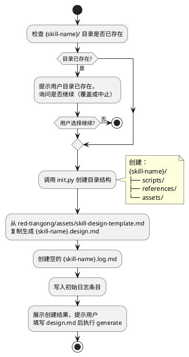
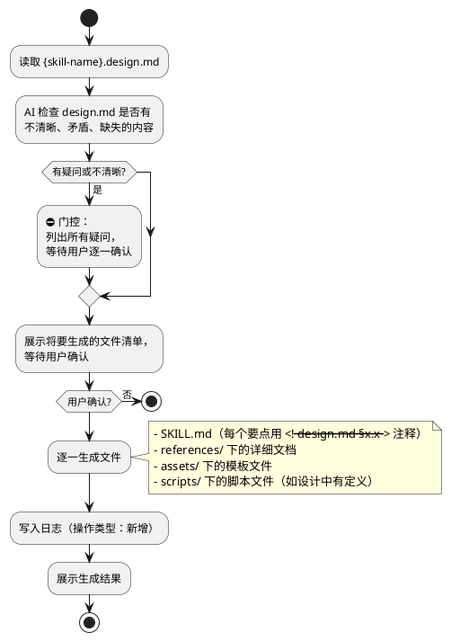
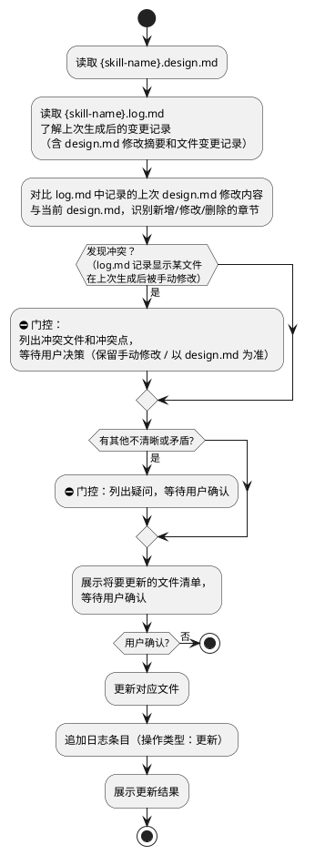

# red-tiangong SKILL 设计文档

---

## SKILL 定义

### 目标

red-tiangong 是一个 SKILL 全生命周期管理助手。它读取用户编写的 `{skill}.design.md` 设计文档，自动生成符合 AgentSkills.io 标准的 SKILL 文件（SKILL.md、references/、assets/ 等），并在后续迭代中追踪变更、保持设计文档与实际文件的一致性。

服务对象：SKILL 开发者本人。
核心价值：让 design.md 成为唯一真实来源，所有生成物都可回溯到设计文档的具体条目。

### SKILL 名

`red-tiangong`

### 快速开始

- "天工，我想创建一个关于 XXXX 的 SKILL"
- "天工，执行设计"（在 design.md 已有的情况下）
- "天工，我更新了设计文档"

### 依赖

- Python: 3.13+
- 其他 SKILL：无
- MCP：无

---

## 目录结构

每个 SKILL 的目录结构如下：

```
{skill-name}/
├── SKILL.md                   # 正式 SKILL 入口文件
├── {skill-name}.design.md     # 设计文档（本文件）
├── {skill-name}.log.md        # 变更日志（只追加，不修改）
├── scripts/                   # 可执行脚本
│   └── init.py
├── references/                # 详细参考文档
└── assets/                    # 模板和资源
    ├── skill-design-template.md
    └── skill-log-template.md
```

### 核心规则

- `{skill}.log.md` 只允许追加，禁止修改已有条目
- `{skill}.design.md` 是唯一真实来源，SKILL.md 中每个要点必须用注释标注来自 design.md 的哪一节
- 生成/更新时以 design.md 为准，不得凭 AI 推断自行扩展功能

---

## 工作流定义

### init

**触发条件**：
- "天工，我想创建 {SKILL名}"
- "天工，帮我创建 {SKILL名}"

**目标**：
创建 SKILL 的标准目录结构，生成 design.md 模板，为后续 generate 做准备。

**主要流程**：



---

### generate

**触发条件**：
- "天工，执行设计"
- "天工，根据设计文档生成 SKILL"
- ⛔ **仅当 SKILL.md 不存在时触发**；若 SKILL.md 已存在，触发 update 工作流

**目标**：
读取 `{skill}.design.md`，首次生成 SKILL.md 及所有 references/、assets/ 文件。

**主要流程**：



**注意**：
- SKILL.md 中每个要点必须用 `<!-- design.md §章节名 -->` 注释标注来源
- 流程图中的逻辑必须转化为步骤列表写入 SKILL.md，不得直接复制流程图到 SKILL.md

---

### update

**触发条件**：
- "天工，我更新了设计文档"
- "天工，同步 design.md 的变更"
- "天工，我改了 design.md，重新生成一下"
- ⛔ **仅当 SKILL.md 已存在时触发**；若 SKILL.md 不存在，触发 generate 工作流

**目标**：
根据 design.md 的最新内容，增量更新已生成的 SKILL 文件，并检测与已有文件的冲突。

**主要流程**：



---

## 文档类型 / 数据类型

### 日志文件（{skill}.log.md）

- **识别特征**：AI 对 SKILL 目录下任何文件做了新增或更新操作
- **处理策略**：只允许追加新条目，禁止修改已有条目
- **输出模板**：`assets/skill-log-template.md`

---

## 模板定义

| 模板文件名 | 用途 |
|-----------|------|
| `skill-design-template.md` | SKILL 设计文档的初始模板，供 init 工作流复制使用 |
| `skill-log-template.md` | 日志条目格式模板，供 generate/update 写日志使用 |

---

## 脚本定义

### `init.py`

```
用途：初始化 SKILL 目录结构
用法：python3 init.py <skill_root> [--skill <name>]
输入：skill_root 路径（SKILL 所在的父目录），可选 skill 名
输出：创建标准子目录和初始文件，打印已创建列表
副作用：创建 scripts/、references/、assets/ 子目录，生成空 log.md
```

---

## 异常处理

| 场景 | 处理方式 |
|------|---------|
| design.md 中有不清晰或矛盾的描述 | ⛔ 门控：列出疑问，等待用户确认，不得自行猜测 |
| 目标文件已存在（重新 generate） | 提示用户，询问是否覆盖，默认不覆盖 |
| log.md 显示文件在上次生成后被手动修改 | ⛔ 门控：列出冲突，由用户决策 |
| 用户输入不明确 | 必须询问用户，不自行猜测 |

---

## 规则（草稿）

1. `design.md` 是唯一真实来源，生成/更新时严格以它为准，不凭推断扩展
2. SKILL.md 中每个要点必须用 `<!-- design.md §章节名 L行号 -->` 注释标注来源（章节名 + 行号）
3. 流程图中的逻辑必须转化为步骤列表写入 SKILL.md，不得直接复制 plantuml/mermaid 到 SKILL.md
4. 日志文件只追加，禁止修改已有条目
5. 所有脚本命令先尝试 python3，失败改用 py
6. 任何门控步骤必须等待用户明确回复，禁止跳过

---

## 待确认事项

- [ ] generate 时，如果用户只改了 design.md 的一部分，是重新生成所有文件还是只更新受影响的文件？
      ✅ 只更新受影响的文件
- [ ] SKILL.md 注释格式：`<!-- design.md §章节名 -->` 还是用行号更精确？
      ✅ 章节名 + 行号，格式：`<!-- design.md §章节名 L行号 -->`
---

## 版本记录

| 日期 | 版本 | 变更说明 |
|------|------|---------|
| 2026-06-15 | v0.1 | 初稿 |
| 2026-06-15 | v0.2 | 根据审查意见优化：完善目标描述、补全 init 目标、完整化 generate/update 流程图、修正模板定义描述、补充规则和待确认事项 |
| 2026-06-15 | v0.3 | 二轮审查修复：① 规则注释格式改为章节名+行号 ② 明确 generate/update 触发边界（SKILL.md 存在与否）③ 修正 init 模板路径指向 red-tiangong/assets/ ④ update 流程改为对比 log.md 中的 design.md 变更摘要 ⑤ skill-log-template 新增 design.md 变更字段 |
