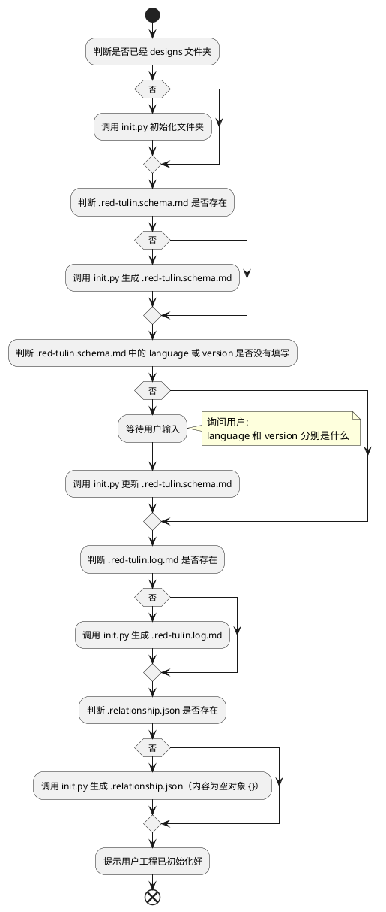
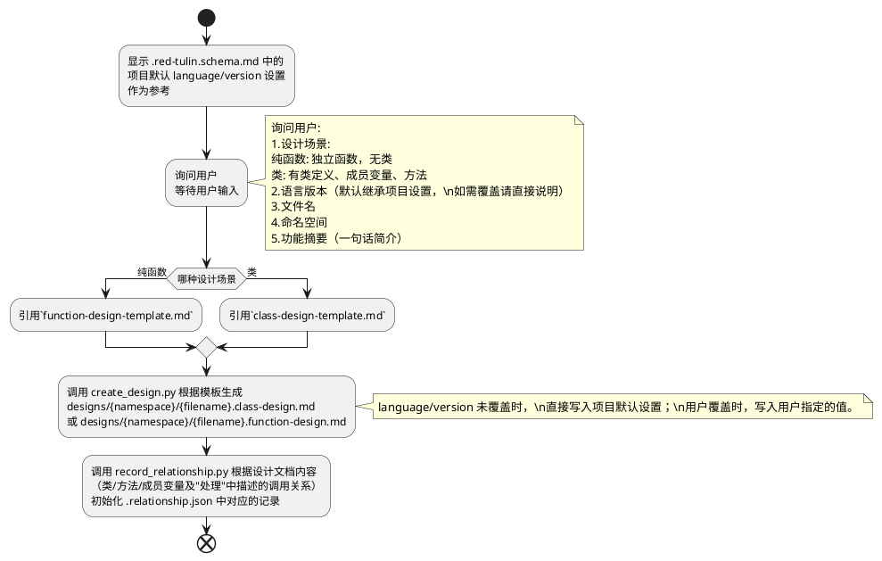
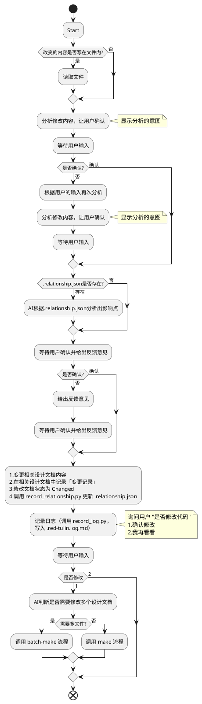
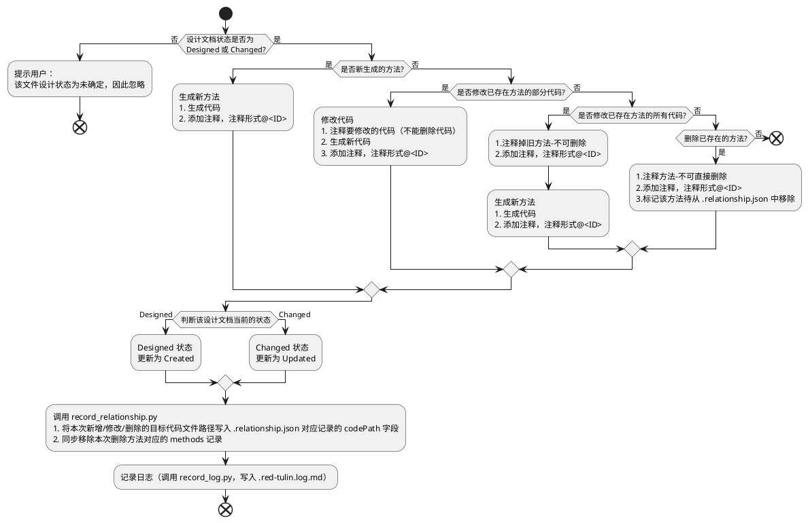

# SKILL 设计模板

> 使用说明：
> 1. 复制本文件，重命名为 `red-tulin.design.md`，放在对应 Skill 目录下
> 2. 填写各章节内容，这是设计文档，不会被 AI 直接引用
> 3. 设计完成后，根据本文档生成正式的 SKILL.md 和 references/ 文件
> 4. 带 `<!-- -->` 的内容是填写说明，完成后可删除

---

## SKILL 定义

### 目标

<!-- 用 2-4 句话描述这个 SKILL 要解决什么问题，为谁服务，核心价值是什么。-->
解决AI生成的代码难维护的问题，人主要负责设计，AI主要负责实现。人的设计要细化到接口做什么
而不是简单的一句话，并且代码跟随设计文档。并且可以让多人协作开发。
服务对象：代码开发者。
核心价值：代码设计回归人类，AI 只是帮忙实现。

### SKILL 名

<!-- 格式：kebab-case，全小写，例如 edk-baize、red-llm-wiki -->

`red-tulin`

### 快速开始

<!-- 用户只需几步就能上手，写触发语义或操作步骤 -->


## 目录结构

<!-- 定义数据目录的标准结构。-->

```
work-space/               # 终端所在的目录
├── designs/              # 代码设计文档，古法编程中的详细设计
│   └── {namespace}/      # 按命名空间/模块划分的子文件夹，设计文档存放于对应命名空间的子文件夹下
├── .relationship.json    # 设计文件间调用关系记录（class/method 级别）
├── .red-tulin.schema.md   # 语言，版本配置文件
└── .red-tulin.log.md      # 代码编写日志
```

## 核心规则

<!-- 列出禁止事项，例如：禁止增减子目录、禁止自动命名路径等 -->
1. 严格遵守 designs 中的设计文档来生成代码，不要臆想，胡乱发散。
2. 有不清晰，拿不准，歧义，需要用户询问，不可自我想象。
---

## 工作流定义

<!-- 每个工作流一节。按以下格式填写。-->

### init

**触发条件**：
<!-- 用户说什么话、或什么事件会触发这个工作流 -->
触发语义：图灵，请帮我初始化工程
**目标**：
<!-- 这个工作流完成后，用户得到了什么 -->
生成工作目录
**主要流程**：
<!-- 用流程图（plantuml/mermaid）或分步列表描述主要逻辑。-->

---

### create-design

**触发条件**：
<!-- 用户说什么话、或什么事件会触发这个工作流 -->
触发语义：图灵，请给我一个代码设计文件
**目标**：
<!-- 这个工作流完成后，用户得到了什么 -->
询问一些简单问题，根据设计场景引用 `class-design-template.md` 或 `function-design-template.md`，生成 {filename}.class-design.md 或 {filename}.function-design.md
**主要流程**：


---


### change-design

**触发条件**：
<!-- 用户说什么话、或什么事件会触发这个工作流 -->
触发语义：
  - 图灵，请帮我更新 xxx 文件中的 yy 方法的处理逻辑为 “{修改内容}” 
  - 图灵，请帮我更新 xxx 文件中的 yy 方法的输入参数 "{修改内容}" 
  - 图灵，请帮我更新 xxx 文件中的 yy 方法的输出参数 “{修改内容}” 
  - 图灵，请帮我更新 xxx 文件中的 yy 类中的成员变量为 “{修改内容}”
**目标**：
<!-- 这个工作流完成后，用户得到了什么 -->
- 修改设计文档
- 如果有关联设计文档需要修改，得到确认后修改
- 记录变更日志
**主要流程**：



---


### make
**触发条件**：
<!-- 用户说什么话、或什么事件会触发这个工作流 -->
触发语义：图灵，请根据 “xxxx.class-design.md” 或 “xxxx.function-design.md” 为我生成代码
**目标**：
<!-- 这个工作流完成后，用户得到了什么 -->
根据单个设计文档，生成对应代码
**目标代码文件路径的确定**：
<!-- 首次生成（Designed→Created）时，由 AI 根据 namespace 及项目既有代码结构推导目标源代码文件路径，
     无法唯一确定时需向用户询问确认；推导/确认结果写入 .relationship.json 对应记录的 codePath 字段。
     后续修改（Changed→Updated）及 validation 工作流直接读取 codePath，不重新推导，
     以保证多次操作使用同一目标文件；若 codePath 记录的文件已不存在，则视为路径失效，重新推导并更新。-->
**主要流程**：



### batch-make
**触发条件**：
<!-- 用户说什么话、或什么事件会触发这个工作流 -->
1. 触发语义：图灵，请根据 folder文件夹 或 多个设计文档为我生成代码（此处"设计文档"泛指 {filename}.class-design.md / {filename}.function-design.md）
2. 触发事件：当 change-design 工作流需要修改多个设计文档，然后用户确认生成代码
**目标**：
批量对多个设计文档逐个执行 make 工作流
**主要流程**：
1. 为每个设计文档逐个执行 `make` 工作流
2. 执行 `validation` 工作流
3. 给出执行报告

### validation
**触发条件**：
<!-- 用户说什么话、或什么事件会触发这个工作流 -->
1.触发语义：图灵，请帮我检查代码
2.触发事件：batch-make 执行完成后（自动触发；单独执行 make 不会自动触发 validation）
1，2 是或的关系
**目标**：
<!-- 这个工作流完成后，用户得到了什么 -->
验证代码和对应关系
**主要流程**：
1. 检查状态为 Created、Updated 的设计文档是否和代码文件一一对应（读取 .relationship.json 中对应记录的 codePath 字段，不重新推导；若 codePath 记录的文件不存在，判定为不一致并在报告中列出）。
2. 检查状态为 Created、Updated 的设计文档中的函数是否都已实现。


## 文档类型 / 数据类型

<!-- 如果 SKILL 需要处理多种类型的输入，在这里定义各类型的处理策略。
     如果不需要区分，删除本节。-->

### design 文档状态

| 状态 | 含义 |
|------|------|
| Designing |  设计中，这个也是文档的初始状态。Designing → Designed 需由用户手动修改 frontmatter 中的 status 完成，不通过任何工作流自动触发  |
| Designed  |  设计完成，但是代码没有生成  |
| Created   |  对应代码已生成  |
| Changed   |  设计文档有修改，但没有同步到代码中 |
| Updated   |  修改已同步到代码中 |

---

## 模板定义

<!-- 列出需要创建哪些模板文件，每个模板放在 assets/ 目录下。-->

| 模板文件名 | 用途 | 对应文档类型 |
|-----------|------|-------------|
| class-design-template.md | 类代码设计文档的模板 | {filename}.class-design.md |
| function-design-template.md | 纯方法代码设计文档的模板 | {filename}.function-design.md |
| .project-structure.template.md |  定义工程的目录结构（暂时预留，后续补充对应工作流）   | .project-structure.md |
| log-template.md | 日志模板 | .red-tulin.log.md |
| change-log-section.md | 「变更记录」章节的共享格式定义，由 create_design.py 拼接进设计文档，避免在两个模板中重复定义 | 无独立文档，嵌入 {filename}.class-design.md / {filename}.function-design.md |

---

## 脚本定义

<!-- 列出需要创建哪些脚本，每个脚本放在 scripts/ 目录下。-->
- init.py
初始化工作路径，创建需要的文件夹
- create_design.py
根据模板（class-design-template.md / function-design-template.md），填充参数，并拼接 change-log-section.md 中定义的「变更记录」格式，生成代码设计文件
- record_relationship.py
根据信息，向 .relationship.json 中更新数据（create-design 首次生成设计文档时用于初始化记录，change-design 修改设计文档时用于更新记录）
- record_log.py
根据 log-template.md 格式，向 .red-tulin.log.md 追加一条日志记录
---

## 异常处理

<!-- 列出关键的异常场景和处理策略 -->

| 场景 | 处理方式 |
|------|---------|
| 触发 make 时，指定的设计文档不存在 | 中断流程，提示用户：“{filename} 不存在” |

---

## 规则（草稿）

<!-- 列出这个 SKILL 的核心约束规则 -->

1. 生成的代码，需严格按照定义中设计文档中的定义来，不可臆断，不可扩展，不可想象
2. 调用 python 脚本时，先使用python3 , 如果失败尝试 py, 如果再失败，则终止流程，提示用户 “请安装python 3.13”
3. 之前完成正确的功能，尽量不要修改。
比如当前的 instruction 是完善功能 A 的，那么只需要专注功能 A，不需要修改其他功能（比如功能 B）。
4. 生成的注释用中文，并使用 UTF-8 编码。
5. 生成的代码有时候会存在中文乱码的情况，所以你在生成中文的时候，需要检查是否有中文乱码，如果有乱码需要修正。
6. 如果修改某个函数的实现，先理解之前函数实现的逻辑。然后在原来的基础上，再进行修改（保留之前的函数逻辑，不要移除）
7. 你操作的环境是 windows 系统
8. 如果用户没有明确说，就不需要编写测试脚本，也不需要写专门的项目说明 md
9. 写代码，不考虑 fallback
10. 代码中不要有 emoji
---

## 待确认事项

<!-- 设计过程中还不确定的决策 -->

- [ ] ...

---

## 版本记录

| 日期 | 版本 | 变更说明 |
|------|------|---------|
| YYYY-MM-DD | v0.1 | 初稿 |
